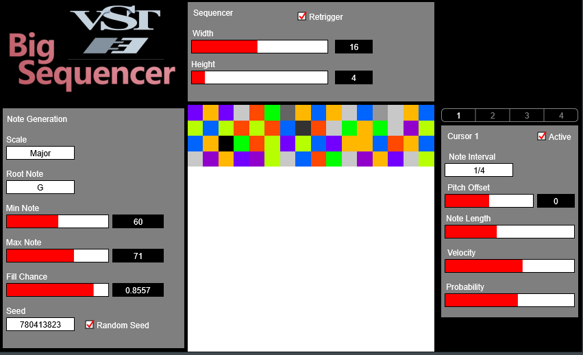

# BigSequencer

The Big Sequencer is a big grid of notes. You can change its width and height.



It has multiple **cursors** that iterate along the grid. Each cursor has multiple parameters:
- active (whether the cursor will play notes)
- interval (quarter note, half note, etc)
- note length (percentage of the interval that the note should play)
- pitch offset (adjust the note pitch by this many semitones)
- velocity (how hard the key press will be)
- probability (chance that the cursor will play the current note)

Use the **retrigger** parameter to make the sequencer restart at the beginning on playback.

## Usage

Once you have the VST installed in your DAW of choice, set the plugin's MIDI output channel to match an instruments input channel.
Turn cursors on and off to have more "hands" playing notes at a time.
Changing the width, height, min note, max note, root note, scale, or fill chance will regenerate the note grid.

## Future Plans

- There are more cursor parameters that should be implemented:
    - offset (how off beat the note will be played)
    - start position (where on the grid the note will start)
    - transition rule (which note the cursor should move to next)
        - this allows for varying patterns on our grid
        - but we need to find out a good way to do it
- More note generation methods (other noise types?)

## Building

To build the app, you will need the Steinberg VST3 SDK:

```
git submodule update --init --recursive
```

Then in the BigSequencer project, we can build using CMake:
```
mkdir build
cd build
cmake ..
cmake --build .
```

On build success, you will find the result in the `build/VST3/Debug` folder.
